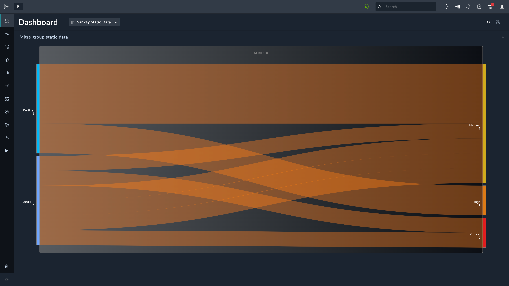

| [Home](../README.md) |
| -------------------- |

# Installation

1. To install a widget, click **Content Hub** > **Discover**.
2. From the list of widgets that appear, search for and select **SOC Overview Sankey**.
3. Click the **SOC Overview Sankey** widget card.
4. Click **Install** on the lower part of the screen to begin installation.

# Configuration

A Sankey chart needs a source node and a target node. It then represents the flow from the source node to the target node using paths known as links. Following table helps customize the **SOC Overview Sankey** widget:

## Record containing JSON Data

This option helps retrieve and display data from a record that has values in `JSON` format. Select the **Record containing JSON Data** option if all data to be rendered is in a specific field of the module. The widget has filters to select only that record that meets the filter conditions.

1. Select **Record containing JSON Data** in the *Data Source* field.

2. Select a module whose records contain `JSON` data in the *Data Source* field. In the following screenshot, we have selected a custom module that we created. For details on editing and creating modules, refer to the *Module Editor* section of the FortiSOAR *Administration Guide*, [here](https://docs.fortinet.com/document/fortisoar/7.4.1/administration-guide/97786/application-editor#Module_Editor).

3. Define filters under the field **Filter Record Which Contains The JSON Data**. In the following screenshot we filter the record by **_Site Type_**. You can define any other filter condition.

    <table>
        <tr>
            <th>NOTE</th>
            <td>The filter conditions should be such that they select <strong><em>only</em></strong> the record that contains relevant JSON data.</td>
        </tr>
    </table>

4. Select the field, whose data is to be displayed, in the **Select Field** field. The drop-down lists **_only_** the fields of type `JSON`. In the following screenshot, we have selected a field within the custom module that we created. For details on editing and creating fields, refer to the *Module Editor* section of the FortiSOAR *Administration Guide*, [here](https://docs.fortinet.com/document/fortisoar/7.4.1/administration-guide/97786/application-editor#Module_Editor).

5. Specify a **Title** for the layer **Layer 1**.

6. Specify the JSON `key` whose `value` is to be rendered in the **Value** field. In the following screenshot, we have selected a key in the JSON data content of the custom module that we created. The example block contains the sample data that we used.

    As is evident from the following screenshot, we use object notation to render each `key`'s value.

    

    <table>
        <thead>
            <th>Example</th>
        </thead>
        <tbody>
            <td>Consider the following JSON data in one of the record's JSON field:
                <pre>"data": {
              "data": [
                {
                  "total": 4,
                  "series_0": Fortinet,
                  "series_1": "Medium",
                  "series_2": "Malware",
                  "series_3": "Detection",
                  "series_1_color": "#D2AC1A",
                  "series_2_color": null,
                  "series_3_color": null
                },
                {
                  "total": 2,
                  "series_0": Fortinet,
                  "series_1": "High",
                  "series_2": "Beaconing",
                  "series_3": "Detection",
                  "series_1_color": "#DE7A13",
                  "series_2_color": null,
                  "series_3_color": null
                },
                {
                  "total": 1,
                  "series_0": FortiSIEM,
                  "series_1": "Medium",
                  "series_2": "Beaconing",
                  "series_3": "Confirmation",
                  "series_1_color": "#D2AC1A",
                  "series_2_color": null,
                  "series_3_color": null
                },
                {
                  "total": 1,
                  "series_0": FortiSIEM,
                  "series_1": "Critical",
                  "series_2": "Malware",
                  "series_3": "Aftermath",
                  "series_1_color": "#e31b1d",
                  "series_2_color": null,
                  "series_3_color": null
                },
                {
                  "total": 1,
                  "series_0": FortiSIEM,
                  "series_1": "Medium",
                  "series_2": "Data Theft",
                  "series_3": "Confirmation",
                  "series_1_color": "#D2AC1A",
                  "series_2_color": null,
                  "series_3_color": null
                },
                {
                  "total": 1,
                  "series_0": FortiSIEM,
                  "series_1": "Medium",
                  "series_2": "Data Theft",
                  "series_3": "Detection",
                  "series_1_color": "#D2AC1A",
                  "series_2_color": null,
                  "series_3_color": null
                },
                {
                  "total": 1,
                  "series_0": FortiSIEM,
                  "series_1": "Medium",
                  "series_2": "Beaconing",
                  "series_3": "Detection",
                  "series_1_color": "#D2AC1A",
                  "series_2_color": null,
                  "series_3_color": null
                },
                {
                  "total": 1,
                  "series_0": FortiSIEM,
                  "series_1": "Critical",
                  "series_2": "Malware",
                  "series_3": "Detection",
                  "series_1_color": "#e31b1d",
                  "series_2_color": null,
                  "series_3_color": null
                }
              ]}
</pre>
                
The following screenshot shows the Sankey Widget in action with this JSON data.

                

            </td>
        </tbody>
    </table>

## Get Live Data

| Fields                | Description                                                                                                                                    |
|-----------------------|------------------------------------------------------------------------------------------------------------------------------------------------|
| Title                 | Specify a title for the SOC Overview Sankey widget as it appears on the dashboard.                                                             |
| Resource              | Select the FortiSOAR&trade; module whose Sankey representation is to be displayed. For example, **_Alerts_**.                                  |
| Filter Criteria       | Define the filter criteria using which to filter the data retrieved by this widget.                                                            |
| Source Node          | Select the a field, within the **_Resource_** module, to render source nodes. Only the fields of type **_text_** are listed.                   |
| Target Node          | Select the picklist, within the **_Resource_** module, to render target nodes. Only the fields of type **_picklist_** are listed.              |
| Target Node Picklist | Target Node Selection will be available only if the Target node type is **pcklist**. For example, **_Incidents_** |

| [Usage](./usage.md) |
| ------------------- |
