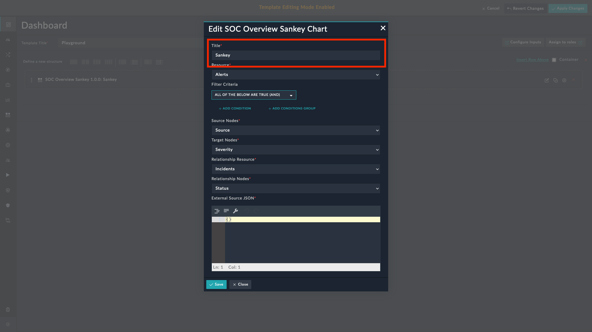
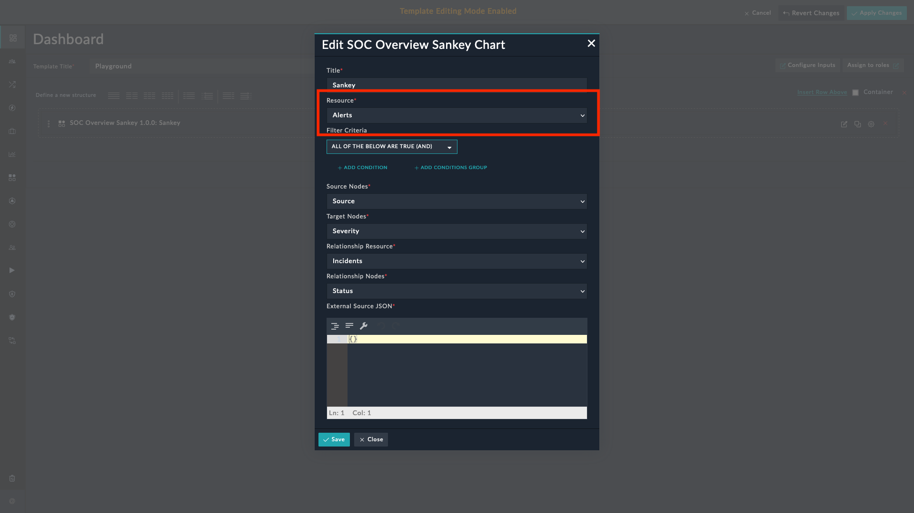
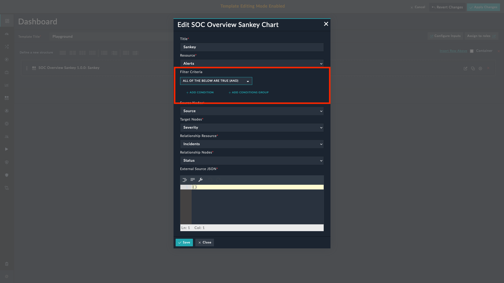
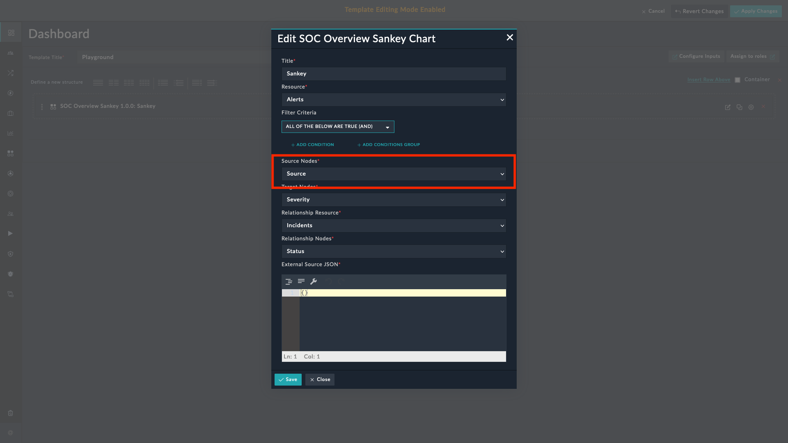
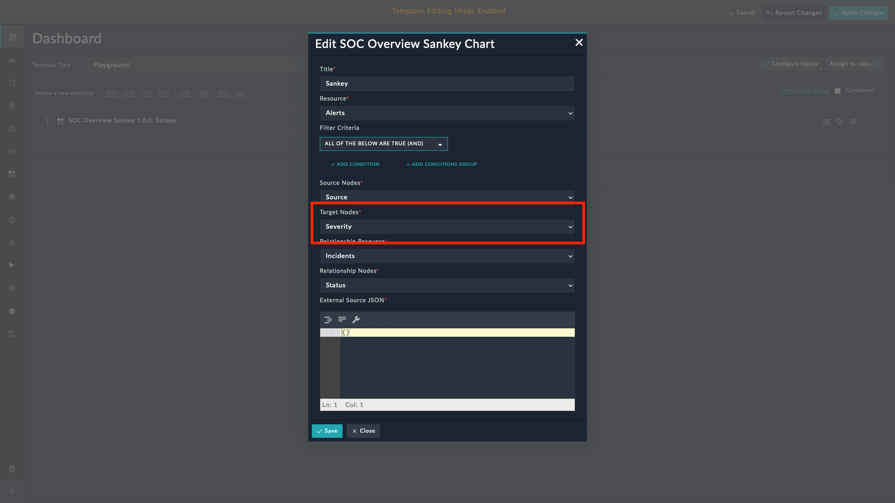
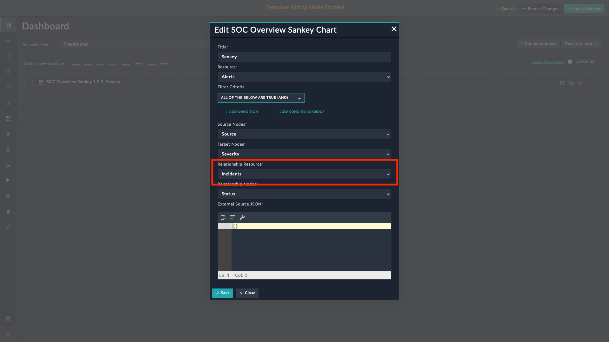
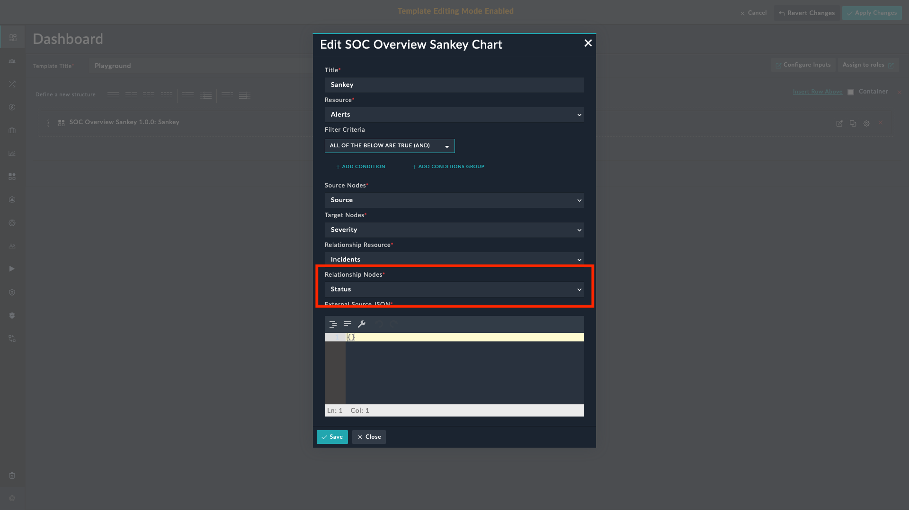
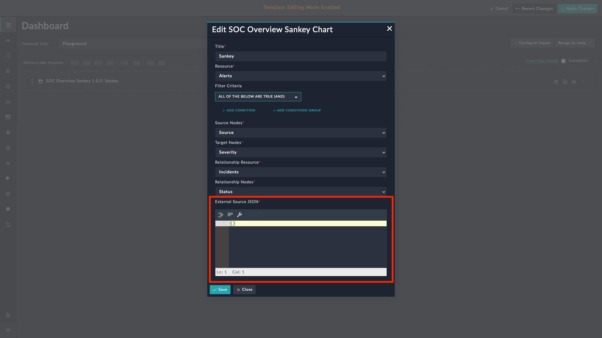

| [Home](../README.md) |
| -------------------- |

# Usage

The **SOC Overview Sankey** widget helps visualize relationship data as per behavior. For example, viewing the data as per status of related incidents of alerts group by source and severity.

You can add this view to a dashboard, or report.

## Visualize Relationship Data for a Preset Interval

You can select from following options:

- 7 Days
- 1 Day
- 1 Hour

    
<!-- 
- Configure the widget by selecting source node, target node, relationship node and setting filters to retrieve the required data.

- The links colors will be picked as per picklist items configuration. -->

## SOC Overview Sankey Widget

1. Edit a *Dashboard*, or a *Report* and select **Add Widget** button.

    

2. Select **SOC Overview Sankey** from the list to bring up the **SOC Overview Sankey** widget's customization modal.

    

3. Specify the title of the visualization of relationship data as per module in the **Title** field.

    

4. Select the module, whose data is to be represented as a Sankey chart as per relationship, in the **Resource** field.

    

5. Define the filter criteria using which to filter the data retrieved by this widget (Optional), in the **Filter Criteria** field. To know more about using the filter criteria, refer to the [Nested Filter](https://docs.fortinet.com/document/fortisoar/7.4.3/user-guide/207943/dashboards-templates-and-widgets#Nested-Filters) section of the FortiSOAR&trade; user guide.

    

6. Select the text field to be grouped for source nodes, in the **Source Nodes** field.

    

7. Select the field to group data for target nodes, in the **Target Nodes** field.

    

8. Select the relationship module, to group data to visualize as per relation, in the **Relationship Resource** field.

    

9. Select the picklist field of selected relationship resource to group the data for relationship nodes, in the **Relationship Nodes** field.

    

10. Input JSON data to render outer source nodes and linking with modules source, in the **External Source JSON** field.

    

### SOC Overview Sankey Widget - View

The following image displays a **SOC Overview Sankey** widget based on an example where you might want to view the data as per severity of related incidents of alerts group by source and severity:

1. Click **1 Day** to display data for the last 1 day.

2. Click **1 Hour** to display data for the last 1 Hour.

3. Click **7 Days** to display data for the last 7 days. This option is a default selection for the initial rendering.

<table>
    <th>NOTE</th>
    <td>If for any specific duration selection if there is no data, then the <strong>SOC Overview Sankey</strong> widget displays the following message:  
    <strong><code>No records found!</code></strong></td>
</table>

| [Installation](./setup.md#installation) | [Configuration](./setup.md#configuration) |
| --------------------------------------- | ----------------------------------------- |
