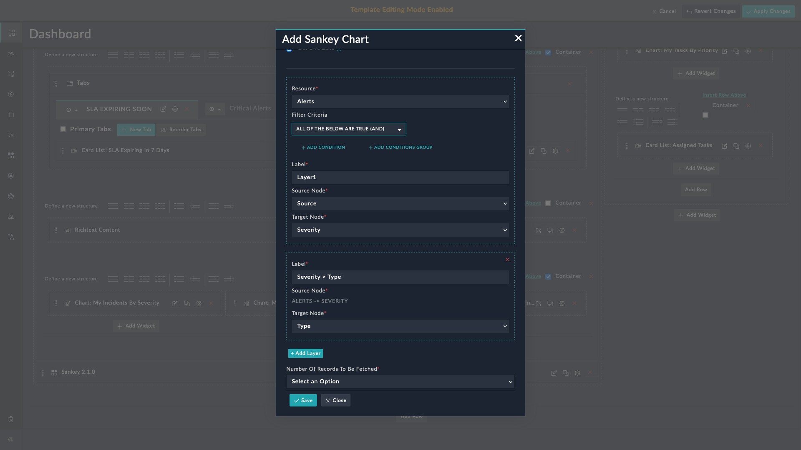
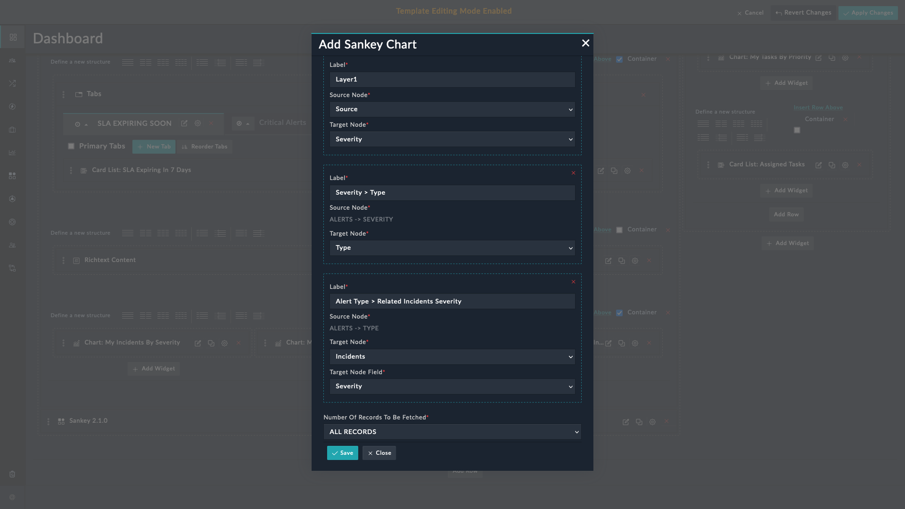

| [Home](../README.md) |
| -------------------- |

# Usage

The **SOC Overview Sankey** widget helps visualize data, which is rendered based on static or live data. To use static data, the **Record Containing JSON Data** option should be selected from the Data Source field while configuring the widget, whereas select the **Get Live Data** option to use live data. You can add this widget to a dashboard, or a report.

## Use static data to visualize data in the SOC Overview Sankey widget  

The **Record containing JSON Data** option helps retrieve and display data from a record that has values in the  `JSON` format. Select this option if all data to be rendered is in a specific field of the module. The widget has filters to select only that record that meets the filter conditions. For example, displaying a chart that represents the number of Mitre Group records group on the basis of their source and severity.

<table>

```
<th>NOTE</th>
<td>The links colors are picked as per picklist items configuration.</td>
```

</table>

### Configuring the SOC Overview Sankey widget to represent Mitre Group Data

1. Edit a *Dashboard*, or a *Report* and select **Add Widget** button.

    

2. Select **SOC Overview Sankey** from the list to bring up the **SOC Overview Sankey** widget's customization modal.

    

3. In the **Title** field, specify the title of the graphical representation. 

4. From the **Data Source** field, select the **Record Containing JSON Data** option.

5. From the **JSON Data Source Modules** drop-down list, select the module whose records contain `JSON` data. For our example, we have selected a custom module named 'Key Store'. For details on editing and creating modules, refer to the *Module Editor* section of the FortiSOAR *Administration Guide*, [here](https://docs.fortinet.com/document/fortisoar/7.5.0/administration-guide/97786/application-editor#Module_Editor). 

    

6. From the **Select Field** drop-down list, select the field, whose data is to be displayed. The drop-down lists **_only_** the fields of type `JSON`. For our example, we have selected a field within the 'Key Store' custom module. For details on editing and creating fields, refer to the *Module Editor* section of the FortiSOAR *Administration Guide*, [here](https://docs.fortinet.com/document/fortisoar/7.5.0/administration-guide/97786/application-editor#Module_Editor).   
    A sample of a `JSON` type field is given [here](#sampleJson).

7. In the **Filter Record Which Contains The JSON** field, specify the keys of the JSON field using which data should be filtered and then appropriately fetched to be displayed in the chart. For our example, we want to display 'Mitre Group Data' and therefore, `Key Equals Mitre Group Data` is added as the filter condition.  
    
    <table>
        <tr>
            <th>NOTE</th>
            <td>The filter conditions should be such that they select <strong><em>only</em></strong> the record that contains relevant JSON data.</td>
        </tr>
    </table>

8. Click **Save** to save the configuration.


#### SOC Overview Sankey widget to represent Mitre Group Data - View

The following image displays a **SOC Overview Sankey** widget based on an example where you want to view the number of Mitre Group records group on the basis of their source and severity:


<table>
    <th>NOTE</th>
    <td>In the case of static data, the duration buttons do not appear as the entire static data in the selected key is  rendered</td>
</table>

#### Sample JSON type field <a name="sampleJson"></a>

Following is a sample of a field that contains data in the `JSON` format, which can be rendered in the Sanky chart:

```JSON
{ 

  "data": [ 

    { 

      "total": 4, 
      "series_0": "Fortinet", 
      "series_1": "Medium", 
      "series_2": "Malware", 
      "series_3": "Detection", 
      "series_1_color": "#D2AC1A", 
      "series_2_color": null, 
      "series_3_color": null 
    }, 

    { 

      "total": 2, 
      "series_0": "Fortinet", 
      "series_1": "High", 
      "series_2": "Beaconing", 
      "series_3": "Detection", 
      "series_1_color": "#DE7A13", 
      "series_2_color": null, 
      "series_3_color": null 
    }, 

    { 

      "total": 1, 
      "series_0": "FortiSIEM", 
      "series_1": "Medium", 
      "series_2": "Beaconing", 
      "series_3": "Confirmation", 
      "series_1_color": "#D2AC1A", 
      "series_2_color": null, 
      "series_3_color": null 
    }, 

    { 

      "total": 1, 
      "series_0": "FortiSIEM", 
      "series_1": "Critical", 
      "series_2": "Malware", 
      "series_3": "Aftermath", 
      "series_1_color": "#e31b1d", 
      "series_2_color": null, 
      "series_3_color": null 

    }, 

    { 

      "total": 1, 
      "series_0": "FortiSIEM", 
      "series_1": "Medium", 
      "series_2": "Data Theft", 
      "series_3": "Confirmation", 
      "series_1_color": "#D2AC1A", 
      "series_2_color": null, 
      "series_3_color": null 
    }, 

    { 

      "total": 1, 
      "series_0": "FortiSIEM", 
      "series_1": "Medium", 
      "series_2": "Data Theft", 
      "series_3": "Detection", 
      "series_1_color": "#D2AC1A", 
      "series_2_color": null, 
      "series_3_color": null 
    }, 

    { 

      "total": 1, 
      "series_0": "FortiSIEM", 
      "series_1": "Medium", 
      "series_2": "Beaconing", 
      "series_3": "Detection", 
      "series_1_color": "#D2AC1A", 
      "series_2_color": null, 
      "series_3_color": null 
    }, 

    { 

      "total": 1, 
      "series_0": "FortiSIEM", 
      "series_1": "Critical", 
      "series_2": "Malware", 
      "series_3": "Detection", 
      "series_1_color": "#e31b1d", 
      "series_2_color": null, 
      "series_3_color": null 
    } 

  ] 

} 
```
## Use live data to visualize relationship data in the SOC Overview Sankey widget  

The **Get Live Data** option helps helps visualize relationship data as per behavior. For example, viewing the data as per the severity of incidents related to alerts grouped by source, severity. and type. 

### Visualize Relationship Data for a Preset Interval

- You can select from following options:

    - Last 6 Months 
    - Last 3 Months
    - Last 30 Days

        

- Configure the widget by selecting the **Get Live Data** option and then selecting the source node, target node, relationship node, and setting filters to retrieve the required data.

- The links colors are picked as per picklist items configuration.

### Configuring the SOC Overview Sankey widget to represent relationship data

1. Edit a *Dashboard*, or a *Report* and select **Add Widget** button.

2. Select **SOC Overview Sankey** from the list to bring up the **SOC Overview Sankey** widget's customization modal.

3. In the **Title** field, specify the title of the visualization of relationship data as per module.

4. From the **Resource** drop-down list, select the module, whose data is to be represented as a Sankey chart as per relationship. For our example, select **Alerts**.

5. (Optional) In the **Filter Criteria** field, specify the filter criteria using which to filter the data retrieved by this widget. To know more about using the filter criteria, refer to the [Nested Filter](https://docs.fortinet.com/document/fortisoar/7.5.0/user-guide/207943/dashboards-templates-and-widgets#Nested-Filters) section of the FortiSOAR™ user guide.

6. In the **Label** field, specify the title of the layer to be displayed on the flow column. For example, `Sources > Severity`, to represent the flow column from alert sources to alert severity.

7. From the the **Source Node** drop-down list, select the field to group data for source nodes. This is the source from which the resource link needs to start. Only the fields of type **_text_** are listed. For our example, select **Source**.

8. From the **Target Nodes** drop-down list, select the field to group data for target nodes. This is target to which the resource link needs to connect. Target nodes must be of type **_picklist_**. For our example, select **Severity**.

9. Click **Add Layer** to add a new layer to the widget. At least **one layer is mandatory**. You can append more layers or even delete a layer. You can have a maximum of **three** layers.<br /> **NOTE**: The target node of the previous layer becomes the source node for the next layer.

    

10. For our example, we require three layers. In the second layer, specify the label of the layer as ` Severity > Type`, to represent the flow column from alert severity to alert type.   
 The **Source Node** field is already populated with the target node of the first layer, which is `Alerts -> Severity` in our example. Next, select the **Target Node** as **Type**. 

 

11. Click **Add Layer** to add the final layer in the widget. In this layer, we want to represent relationship data, i.e., the incidents related to alerts. In this layer, specify the label of the layer as ` Alert Type > Related Incidents Severity`, to represent the flow column from alert type to related incidents severity.  
     The **Source Node** field is already populated with the target node of the second layer, which is `Alerts -> Type` in our example.  
     Next, select the **Target Node** as **Incidents** as we want to represent relationship data. Now, since the target node selected is a related module, another drop-down list named **Target Node Picklist** is displayed. Select the **Severity** picklist to render the target nodes.  

     

12. Click **Save** to save the configuration.


### SOC Overview Sankey widget to represent relationship data

The following image displays a **SOC Overview Sankey** widget based on an example where you might want to view the data as per the severity of incidents related to alerts grouped by source, severity. and type. 


1. Click **Last 6 Months** to display data for the last 6 months. This option is a default selection for the initial rendering.

2. Click **Last 3 Months** to display data for the last 3 months.

3. Click **Last 30 Days** to display data for the last 30 days.

<table>
    <th>NOTE</th>
    <td>If for any specific duration selection if there is no data, then the <strong>SOC Overview Sankey</strong> widget displays the following message:<br><br>
    <strong><code>No records found!</code></strong>. Also, if the data selection is not valid then the nodes and links data are not formed correctly. In this case,  the <strong>SOC Overview Sankey</strong> widget displays the following message:<br><br>
    <strong><code>Nodes and Links not created by the given data!</code></strong></td>
</table>


| [Installation](./setup.md#installation) | [Configuration](./setup.md#configuration) |
| --------------------------------------- | ----------------------------------------- |
